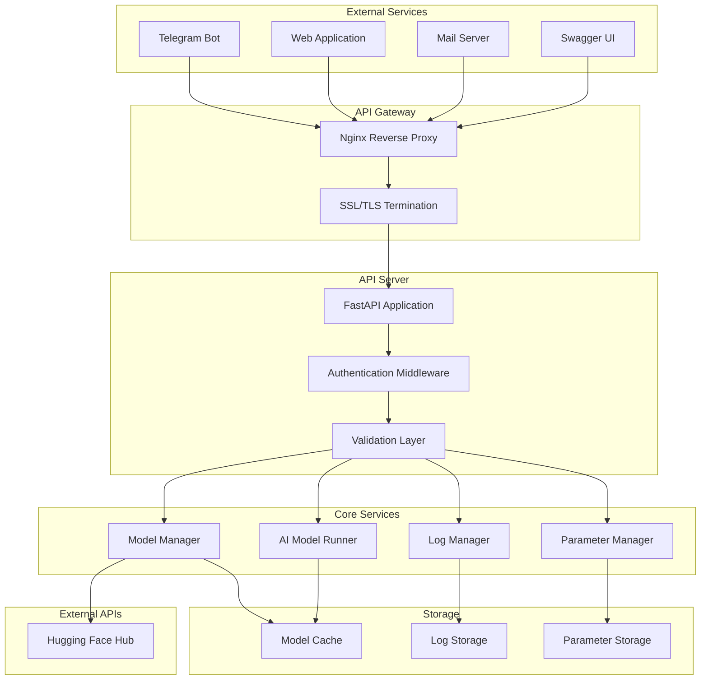
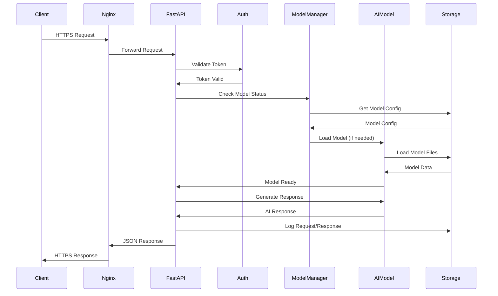
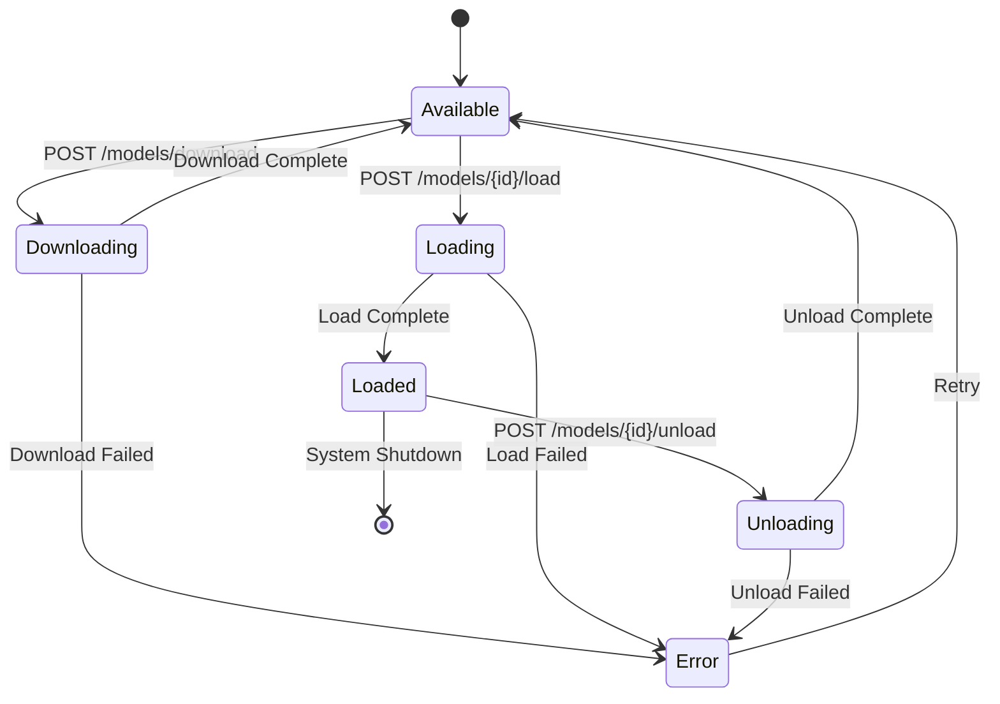
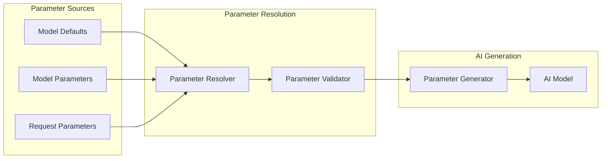
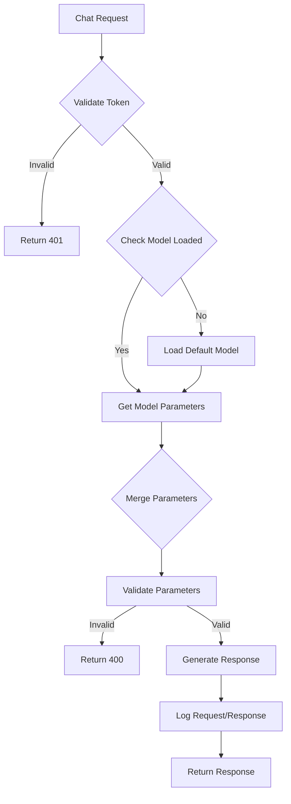
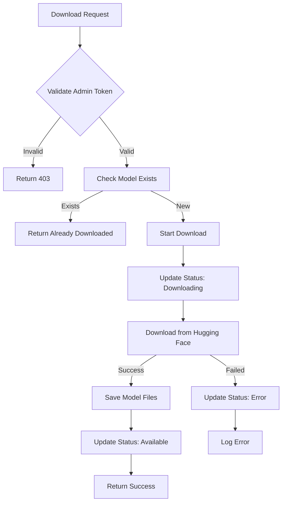

# API Documentation

**Version:** v1.0.0  
**Base URL:** https://cryptomaltese.com/api/v1  
**Documentation UI:** https://cryptomaltese.com/docs

---

## Table of Contents
1. [API Endpoint Tree](#api-endpoint-tree)
2. [Interface Diagrams](#interface-diagrams)
3. [Authentication](#authentication)
4. [Data Flow Diagrams](#data-flow-diagrams)
5. [Error Handling](#error-handling)
6. [Rate Limiting](#rate-limiting)
7. [Examples](#examples)

---

## API Endpoint Tree

```
/api/v1/
├── /chat
│   └── POST                    # Generate AI response
├── /health
│   └── GET                     # System health check
├── /models
│   ├── GET                     # List available models
│   ├── POST /download          # Download model from Hugging Face
│   └── /{model_id}/
│       ├── POST /load          # Load model into memory
│       ├── POST /unload        # Unload model from memory
│       └── /parameters
│           ├── GET             # Get model parameters
│           ├── PUT             # Update model parameters
│           └── POST /reset     # Reset parameters to defaults
└── /admin/
    ├── GET /system-status      # Get system status
    ├── POST /cleanup           # Trigger system cleanup
    └── POST /purge-logs        # Purge old log files
```

---

## Interface Diagrams

### 1. System Architecture Overview



### 2. Request Flow Diagram



### 3. Model Management Flow



### 4. Parameter Management Flow



---

## Authentication

### Authentication Methods

1. **API Key Authentication**
   - Header: `Authorization: Bearer <api_key>`
   - Admin endpoints require admin-level API keys

2. **Token Types**
   - **Standard Token**: Access to chat, model listing, parameter management
   - **Admin Token**: Full access including system administration

### Token Management

```json
{
  "token_type": "standard|admin",
  "permissions": [
    "chat:read",
    "chat:write",
    "models:read",
    "models:write",
    "parameters:read",
    "parameters:write",
    "admin:system",
    "admin:cleanup"
  ],
  "rate_limit": "1000/hour",
  "expires_at": "2024-12-31T23:59:59Z"
}
```

---

## Data Flow Diagrams

### 1. Chat Request Processing



### 2. Model Download Process



---

## Error Handling

### HTTP Status Codes

| Code | Description | Usage |
|------|-------------|-------|
| 200 | OK | Successful operations |
| 201 | Created | Model downloaded/loaded |
| 400 | Bad Request | Invalid parameters |
| 401 | Unauthorized | Missing/invalid token |
| 403 | Forbidden | Insufficient permissions |
| 404 | Not Found | Model not found |
| 409 | Conflict | Model already loaded |
| 422 | Unprocessable Entity | Validation errors |
| 500 | Internal Server Error | System errors |
| 503 | Service Unavailable | Model not ready |

### Error Response Format

```json
{
  "error": {
    "code": "MODEL_NOT_FOUND",
    "message": "Model with ID 'gpt2' not found",
    "details": {
      "model_id": "gpt2",
      "available_models": ["gpt2-medium", "gpt2-large"]
    },
    "timestamp": "2024-01-15T10:30:00Z",
    "request_id": "req_123456789"
  }
}
```

---

## Rate Limiting

### Rate Limit Headers

```
X-RateLimit-Limit: 1000
X-RateLimit-Remaining: 999
X-RateLimit-Reset: 1642233600
```

### Rate Limits by Endpoint

| Endpoint | Standard Token | Admin Token |
|----------|----------------|-------------|
| `/chat` | 100/hour | 1000/hour |
| `/models/*` | 50/hour | 500/hour |
| `/admin/*` | 0/hour | 100/hour |

---

## Examples

### 1. Chat Request

```bash
curl -X POST "https://cryptomaltese.com/api/v1/chat" \
  -H "Authorization: Bearer your_api_key" \
  -H "Content-Type: application/json" \
  -d '{
    "message": "Hello, how are you?",
    "channel": "webapp",
    "user_id": "user123",
    "parameters": {
      "temperature": 0.7,
      "max_length": 150
    }
  }'
```

**Response:**
```json
{
  "response": "Hello! I'm doing well, thank you for asking. How can I help you today?",
  "model": "gpt2-medium",
  "timestamp": "2024-01-15T10:30:00Z",
  "parameters_used": {
    "temperature": 0.7,
    "max_length": 150,
    "top_k": 50,
    "top_p": 0.9
  }
}
```

### 2. Model Management

```bash
# List models
curl -X GET "https://cryptomaltese.com/api/v1/models" \
  -H "Authorization: Bearer your_api_key"

# Load model
curl -X POST "https://cryptomaltese.com/api/v1/models/gpt2-medium/load" \
  -H "Authorization: Bearer your_api_key"

# Update parameters
curl -X PUT "https://cryptomaltese.com/api/v1/models/gpt2-medium/parameters" \
  -H "Authorization: Bearer your_api_key" \
  -H "Content-Type: application/json" \
  -d '{
    "temperature": 0.8,
    "top_k": 40
  }'
```

### 3. System Administration

```bash
# Get system status
curl -X GET "https://cryptomaltese.com/api/v1/admin/system-status" \
  -H "Authorization: Bearer admin_api_key"

# Trigger cleanup
curl -X POST "https://cryptomaltese.com/api/v1/admin/cleanup" \
  -H "Authorization: Bearer admin_api_key" \
  -H "Content-Type: application/json" \
  -d '{
    "operations": ["clean_logs", "clean_cache"],
    "force": false
  }'
```

---

## Integration Examples

### 1. Telegram Bot Integration

```python
import requests

def send_to_ai_api(message, user_id):
    response = requests.post(
        "https://cryptomaltese.com/api/v1/chat",
        headers={"Authorization": "Bearer your_api_key"},
        json={
            "message": message,
            "channel": "telegram",
            "user_id": str(user_id)
        }
    )
    return response.json()["response"]
```

### 2. Web Application Integration

```javascript
async function chatWithAI(message, userId) {
    const response = await fetch('https://cryptomaltese.com/api/v1/chat', {
        method: 'POST',
        headers: {
            'Authorization': 'Bearer your_api_key',
            'Content-Type': 'application/json'
        },
        body: JSON.stringify({
            message: message,
            channel: 'webapp',
            user_id: userId,
            parameters: {
                temperature: 0.7,
                max_length: 200
            }
        })
    });
    
    return await response.json();
}
```

### 3. Email Service Integration

#### Python Email Service Example

```python
import smtplib
import requests
from email.mime.text import MIMEText
from email.mime.multipart import MIMEMultipart
from typing import Optional

class EmailAIService:
    def __init__(self, api_key: str, smtp_server: str, smtp_port: int, 
                 email_user: str, email_password: str):
        self.api_key = api_key
        self.api_url = "https://cryptomaltese.com/api/v1/chat"
        self.smtp_server = smtp_server
        self.smtp_port = smtp_port
        self.email_user = email_user
        self.email_password = email_password
    
    def generate_ai_response(self, message: str, user_id: str) -> Optional[str]:
        """Generate AI response for email content"""
        try:
            response = requests.post(
                self.api_url,
                headers={
                    "Authorization": f"Bearer {self.api_key}",
                    "Content-Type": "application/json"
                },
                json={
                    "message": message,
                    "channel": "email",
                    "user_id": user_id,
                    "parameters": {
                        "temperature": 0.8,
                        "max_length": 500,
                        "top_p": 0.9
                    }
                },
                timeout=60
            )
            response.raise_for_status()
            return response.json()["response"]
        except requests.RequestException as e:
            print(f"Error calling AI API: {e}")
            return None
    
    def send_ai_email(self, to_email: str, subject: str, user_message: str, 
                     user_id: str) -> bool:
        """Send email with AI-generated response"""
        try:
            # Generate AI response
            ai_response = self.generate_ai_response(user_message, user_id)
            if not ai_response:
                return False
            
            # Create email
            msg = MIMEMultipart()
            msg['From'] = self.email_user
            msg['To'] = to_email
            msg['Subject'] = f"AI Response: {subject}"
            
            # Email body
            body = f"""
            Original Message:
            {user_message}
            
            ---
            
            AI Response:
            {ai_response}
            
            ---
            This response was generated by our AI assistant.
            """
            
            msg.attach(MIMEText(body, 'plain'))
            
            # Send email
            with smtplib.SMTP(self.smtp_server, self.smtp_port) as server:
                server.starttls()
                server.login(self.email_user, self.email_password)
                server.send_message(msg)
            
            return True
            
        except Exception as e:
            print(f"Error sending email: {e}")
            return False

# Usage example
if __name__ == "__main__":
    email_service = EmailAIService(
        api_key="your_api_key",
        smtp_server="smtp.gmail.com",
        smtp_port=587,
        email_user="your_email@gmail.com",
        email_password="your_app_password"
    )
    
    # Send AI-powered email response
    success = email_service.send_ai_email(
        to_email="customer@example.com",
        subject="Customer Inquiry",
        user_message="I need help with my account setup",
        user_id="customer_123"
    )
    
    if success:
        print("AI email sent successfully!")
    else:
        print("Failed to send AI email")
```

#### Node.js Email Service Example

```javascript
const nodemailer = require('nodemailer');
const axios = require('axios');

class EmailAIService {
    constructor(apiKey, emailConfig) {
        this.apiKey = apiKey;
        this.apiUrl = 'https://cryptomaltese.com/api/v1/chat';
        this.transporter = nodemailer.createTransporter({
            host: emailConfig.host,
            port: emailConfig.port,
            secure: emailConfig.secure,
            auth: {
                user: emailConfig.user,
                pass: emailConfig.password
            }
        });
    }

    async generateAIResponse(message, userId) {
        try {
            const response = await axios.post(this.apiUrl, {
                message: message,
                channel: 'email',
                user_id: userId,
                parameters: {
                    temperature: 0.8,
                    max_length: 500,
                    top_p: 0.9
                }
            }, {
                headers: {
                    'Authorization': `Bearer ${this.apiKey}`,
                    'Content-Type': 'application/json'
                },
                timeout: 60000
            });

            return response.data.response;
        } catch (error) {
            console.error('Error calling AI API:', error.message);
            return null;
        }
    }

    async sendAIEmail(toEmail, subject, userMessage, userId) {
        try {
            // Generate AI response
            const aiResponse = await this.generateAIResponse(userMessage, userId);
            if (!aiResponse) {
                return false;
            }

            // Create email content
            const emailBody = `
Original Message:
${userMessage}

---

AI Response:
${aiResponse}

---
This response was generated by our AI assistant.
            `;

            // Send email
            const mailOptions = {
                from: this.transporter.options.auth.user,
                to: toEmail,
                subject: `AI Response: ${subject}`,
                text: emailBody
            };

            await this.transporter.sendMail(mailOptions);
            return true;

        } catch (error) {
            console.error('Error sending email:', error.message);
            return false;
        }
    }
}

// Usage example
const emailService = new EmailAIService('your_api_key', {
    host: 'smtp.gmail.com',
    port: 587,
    secure: false,
    user: 'your_email@gmail.com',
    password: 'your_app_password'
});

// Send AI-powered email response
emailService.sendAIEmail(
    'customer@example.com',
    'Customer Inquiry',
    'I need help with my account setup',
    'customer_123'
).then(success => {
    if (success) {
        console.log('AI email sent successfully!');
    } else {
        console.log('Failed to send AI email');
    }
});
```

#### Email Webhook Integration Example

```python
from flask import Flask, request, jsonify
import requests
import smtplib
from email.mime.text import MIMEText
from email.mime.multipart import MIMEMultipart

app = Flask(__name__)

class EmailWebhookHandler:
    def __init__(self, api_key: str, email_config: dict):
        self.api_key = api_key
        self.email_config = email_config
        self.ai_api_url = "https://cryptomaltese.com/api/v1/chat"
    
    def process_incoming_email(self, from_email: str, subject: str, 
                              message: str, user_id: str) -> bool:
        """Process incoming email and send AI response"""
        try:
            # Generate AI response
            ai_response = self._call_ai_api(message, user_id)
            if not ai_response:
                return False
            
            # Send response email
            return self._send_response_email(from_email, subject, message, ai_response)
            
        except Exception as e:
            print(f"Error processing email: {e}")
            return False
    
    def _call_ai_api(self, message: str, user_id: str) -> str:
        """Call AI API to generate response"""
        response = requests.post(
            self.ai_api_url,
            headers={
                "Authorization": f"Bearer {self.api_key}",
                "Content-Type": "application/json"
            },
            json={
                "message": message,
                "channel": "email",
                "user_id": user_id,
                "parameters": {
                    "temperature": 0.7,
                    "max_length": 400,
                    "top_p": 0.9
                }
            },
            timeout=60
        )
        response.raise_for_status()
        return response.json()["response"]
    
    def _send_response_email(self, to_email: str, original_subject: str, 
                           original_message: str, ai_response: str) -> bool:
        """Send AI response via email"""
        try:
            msg = MIMEMultipart()
            msg['From'] = self.email_config['user']
            msg['To'] = to_email
            msg['Subject'] = f"Re: {original_subject}"
            
            body = f"""
Thank you for your email. Here's our AI-generated response:

Original Message:
{original_message}

---

AI Response:
{ai_response}

---
This is an automated response generated by our AI assistant.
For urgent matters, please contact our human support team.
            """
            
            msg.attach(MIMEText(body, 'plain'))
            
            with smtplib.SMTP(self.email_config['host'], self.email_config['port']) as server:
                server.starttls()
                server.login(self.email_config['user'], self.email_config['password'])
                server.send_message(msg)
            
            return True
            
        except Exception as e:
            print(f"Error sending response email: {e}")
            return False

# Initialize webhook handler
email_handler = EmailWebhookHandler(
    api_key="your_api_key",
    email_config={
        "host": "smtp.gmail.com",
        "port": 587,
        "user": "support@yourcompany.com",
        "password": "your_app_password"
    }
)

@app.route('/webhook/email', methods=['POST'])
def email_webhook():
    """Webhook endpoint for incoming emails"""
    try:
        data = request.get_json()
        
        # Extract email data (adjust based on your email service provider)
        from_email = data.get('from')
        subject = data.get('subject')
        message = data.get('message')
        user_id = data.get('user_id', from_email)  # Use email as user ID if not provided
        
        if not all([from_email, subject, message]):
            return jsonify({"error": "Missing required fields"}), 400
        
        # Process the email
        success = email_handler.process_incoming_email(
            from_email, subject, message, user_id
        )
        
        if success:
            return jsonify({"status": "success", "message": "Email processed and response sent"})
        else:
            return jsonify({"status": "error", "message": "Failed to process email"}), 500
            
    except Exception as e:
        return jsonify({"error": str(e)}), 500

if __name__ == '__main__':
    app.run(debug=True, port=5000)
```

---

## Monitoring and Observability

### Health Check Endpoint

```bash
curl -X GET "https://cryptomaltese.com/api/v1/health"
```

**Response:**
```json
{
  "status": "healthy",
  "timestamp": "2024-01-15T10:30:00Z",
  "version": "1.0.0",
  "uptime": "86400",
  "services": {
    "model_manager": "healthy",
    "ai_engine": "healthy",
    "database": "healthy"
  }
}
```

### System Status Endpoint

```bash
curl -X GET "https://cryptomaltese.com/api/v1/admin/system-status" \
  -H "Authorization: Bearer admin_api_key"
```

**Response:**
```json
{
  "status": "healthy",
  "disk_usage": {
    "total": 107374182400,
    "used": 53687091200,
    "free": 53687091200,
    "usage_percent": 50.0
  },
  "memory_usage": {
    "total": 8589934592,
    "used": 4294967296,
    "free": 4294967296,
    "usage_percent": 50.0
  },
  "model_status": {
    "loaded_model": "gpt2-medium",
    "model_memory_usage": 1073741824
  },
  "last_cleanup": "2024-01-15T09:00:00Z"
}
```

---

**Document Version:** v1.0.0  
**Last Updated:** 2024-01-15  
**Next Review:** 2024-02-15 