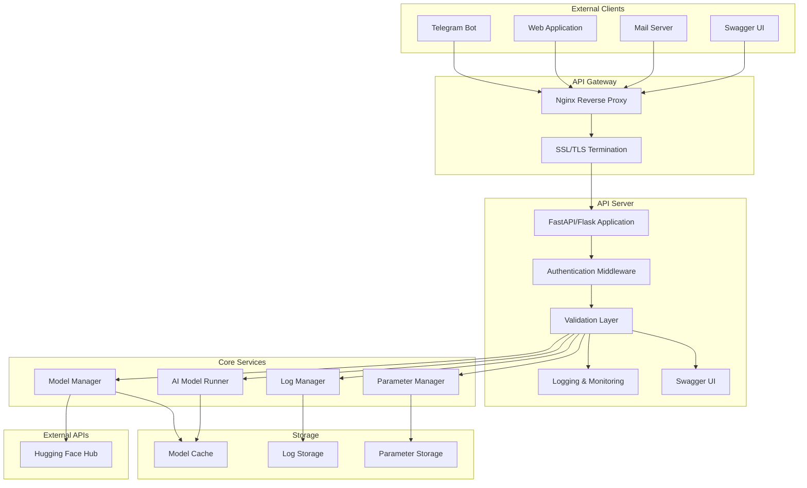

# Technical Architecture

## System Architecture Diagram

## Component List for Implementation

- **Nginx Reverse Proxy**: SSL/TLS termination, HTTP to HTTPS redirection, forwarding to API server
- **API Server (FastAPI/Flask)**: Main RESTful API, OpenAPI/Swagger UI
- **Authentication Middleware**: API key/admin token validation, permission checks
- **Validation Layer**: Input validation, error handling
- **Logging & Monitoring**: Request/response logging, health/status endpoints, log rotation/purging
- **Model Manager**: List/load/unload/download models, enforce single-model-in-memory, track status
- **AI Model Runner**: Interface to AI model code, inference, support for multiple formats
- **Parameter Manager**: Retrieve/update/reset parameters, validation, change tracking
- **Log Manager**: Log storage and cleanup
- **Model Cache**: Store downloaded/loaded models
- **Log Storage**: Persist logs
- **Parameter Storage**: Persist parameter configs
- **Hugging Face Hub Client**: Download models, handle authentication

---

# Technical Specifications

**Version:** v1.0.0
**Approval Status:** Approved

## 1. System Architecture Overview

- API server (FastAPI or Flask) as the main entry point.
- AI model runner module (reuse from existing repo).
- Logging and monitoring module.
- Authentication middleware.

## 2. API Specifications

### POST /api/v1/chat
- **Request:**
  - `message`: string
  - `channel`: string (e.g., telegram, webapp, mail)
  - `user_id`: string
  - `parameters`: object (optional, override model's default parameters)
    - `temperature`: number (optional, 0.0 to 2.0)
    - `top_k`: number (optional, 1 to 100)
    - `top_p`: number (optional, 0.0 to 1.0)
    - `max_length`: number (optional, 1 to 2048)
    - `repetition_penalty`: number (optional, 0.0 to 2.0)
    - `do_sample`: boolean (optional)
    - `num_beams`: number (optional, 1 to 10)
    - `length_penalty`: number (optional, 0.0 to 2.0)
    - `early_stopping`: boolean (optional)
- **Response:**
  - `response`: string
  - `model`: string
  - `timestamp`: string (ISO8601)
  - `parameters_used`: object (actual parameters used for generation)
- **Constraints:**
  - Response time must not exceed 60 seconds.
  - Request parameters override model's default parameters for this specific request.

### GET /api/v1/health
- **Response:**
  - `status`: string (e.g., ok)

### GET /api/v1/models
- **Description:** List all available AI models
- **Response:**
  - `models`: array of model objects
    - `id`: string (unique model identifier)
    - `name`: string (human-readable model name)
    - `status`: string (available, loaded, loading, error)
    - `description`: string (optional model description)
    - `parameters`: object (model configuration parameters)
- **Authentication:** Required

### POST /api/v1/models/{model_id}/load
- **Description:** Load a specific AI model into memory
- **Path Parameters:**
  - `model_id`: string (unique model identifier)
- **Request Body:**
  - `config`: object (optional model-specific configuration)
- **Response:**
  - `status`: string (success, error)
  - `message`: string (status description)
  - `model_id`: string
  - `loaded_at`: string (ISO8601 timestamp)
- **Authentication:** Required
- **Constraints:**
  - Only one model can be loaded at a time
  - Loading a new model will unload the currently loaded model

### POST /api/v1/models/{model_id}/unload
- **Description:** Unload a specific AI model from memory
- **Path Parameters:**
  - `model_id`: string (unique model identifier)
- **Response:**
  - `status`: string (success, error)
  - `message`: string (status description)
  - `model_id`: string
  - `unloaded_at`: string (ISO8601 timestamp)
- **Authentication:** Required

### POST /api/v1/models/download
- **Description:** Download a model from Hugging Face Hub
- **Request Body:**
  - `model_name`: string (Hugging Face model identifier, e.g., "microsoft/DialoGPT-medium")
  - `model_format`: string (optional, preferred format: safetensors, gguf, pytorch)
  - `auth_token`: string (optional, Hugging Face token for private models)
- **Response:**
  - `status`: string (success, error, downloading)
  - `message`: string (status description)
  - `model_id`: string (assigned local identifier)
  - `download_progress`: number (0-100, if downloading)
  - `estimated_time`: string (estimated completion time)
- **Authentication:** Required
- **Constraints:**
  - Large models may take significant time to download
  - Progress updates available via polling

### POST /api/v1/admin/cleanup
- **Description:** Trigger system cleanup operations
- **Request Body:**
  - `operations`: array of strings (clean_logs, clean_cache, clean_models, clean_temp, full_cleanup)
  - `force`: boolean (optional, force cleanup even if system is busy)
- **Response:**
  - `status`: string (success, error, running)
  - `message`: string (status description)
  - `operations_completed`: array of strings
  - `space_freed`: number (bytes freed)
  - `started_at`: string (ISO8601 timestamp)
- **Authentication:** Required (Admin privileges)
- **Constraints:**
  - May take several minutes to complete
  - Should not be run while model is actively processing requests

### POST /api/v1/admin/purge-logs
- **Description:** Purge old log files to free disk space
- **Request Body:**
  - `older_than_days`: number (optional, default: 30)
  - `keep_latest_files`: number (optional, default: 100)
  - `log_levels`: array of strings (optional, e.g., ["DEBUG", "INFO"])
- **Response:**
  - `status`: string (success, error)
  - `message`: string (status description)
  - `files_removed`: number
  - `space_freed`: number (bytes freed)
  - `purged_at`: string (ISO8601 timestamp)
- **Authentication:** Required (Admin privileges)

### GET /api/v1/admin/system-status
- **Description:** Get detailed system status and resource usage
- **Response:**
  - `status`: string (healthy, warning, critical)
  - `disk_usage`: object
    - `total`: number (total disk space in bytes)
    - `used`: number (used disk space in bytes)
    - `free`: number (free disk space in bytes)
    - `usage_percent`: number
  - `memory_usage`: object
    - `total`: number (total RAM in bytes)
    - `used`: number (used RAM in bytes)
    - `free`: number (free RAM in bytes)
    - `usage_percent`: number
  - `model_status`: object
    - `loaded_model`: string (currently loaded model ID)
    - `model_memory_usage`: number (bytes used by model)
  - `last_cleanup`: string (ISO8601 timestamp of last cleanup)
- **Authentication:** Required (Admin privileges)

### GET /api/v1/models/{model_id}/parameters
- **Description:** Get current parameter configuration for a specific model
- **Path Parameters:**
  - `model_id`: string (unique model identifier)
- **Response:**
  - `model_id`: string
  - `parameters`: object
    - `temperature`: number (0.0 to 2.0, default: 1.0)
    - `top_k`: number (1 to 100, default: 50)
    - `top_p`: number (0.0 to 1.0, default: 0.9)
    - `max_length`: number (1 to 2048, default: 100)
    - `repetition_penalty`: number (0.0 to 2.0, default: 1.0)
    - `do_sample`: boolean (default: true)
    - `num_beams`: number (1 to 10, default: 1)
    - `length_penalty`: number (0.0 to 2.0, default: 1.0)
    - `early_stopping`: boolean (default: false)
    - `pad_token_id`: number (optional)
    - `eos_token_id`: number (optional)
  - `last_updated`: string (ISO8601 timestamp)
- **Authentication:** Required

### PUT /api/v1/models/{model_id}/parameters
- **Description:** Update parameter configuration for a specific model
- **Path Parameters:**
  - `model_id`: string (unique model identifier)
- **Request Body:**
  - `parameters`: object (subset of available parameters to update)
    - `temperature`: number (optional, 0.0 to 2.0)
    - `top_k`: number (optional, 1 to 100)
    - `top_p`: number (optional, 0.0 to 1.0)
    - `max_length`: number (optional, 1 to 2048)
    - `repetition_penalty`: number (optional, 0.0 to 2.0)
    - `do_sample`: boolean (optional)
    - `num_beams`: number (optional, 1 to 10)
    - `length_penalty`: number (optional, 0.0 to 2.0)
    - `early_stopping`: boolean (optional)
    - `pad_token_id`: number (optional)
    - `eos_token_id`: number (optional)
- **Response:**
  - `status`: string (success, error)
  - `message`: string (status description)
  - `model_id`: string
  - `updated_parameters`: object (only the parameters that were updated)
  - `updated_at`: string (ISO8601 timestamp)
- **Authentication:** Required

### POST /api/v1/models/{model_id}/parameters/reset
- **Description:** Reset model parameters to default values
- **Path Parameters:**
  - `model_id`: string (unique model identifier)
- **Response:**
  - `status`: string (success, error)
  - `message`: string (status description)
  - `model_id`: string
  - `default_parameters`: object (all default parameters)
  - `reset_at`: string (ISO8601 timestamp)
- **Authentication:** Required

## 3. Data Models

### Chat Request/Response
- **ChatRequest:**
  - message: string
  - channel: string
  - user_id: string
  - parameters: object (optional, override model's default parameters)
- **ChatResponse:**
  - response: string
  - model: string
  - timestamp: string
  - parameters_used: object (actual parameters used for generation)

### Model Management
- **Model:**
  - id: string (unique model identifier)
  - name: string (human-readable model name)
  - status: string (available, loaded, loading, error, downloading)
  - description: string (optional)
  - format: string (safetensors, gguf, pytorch, onnx, etc.)
  - size: number (model size in bytes)
  - source: string (huggingface, local, etc.)
  - parameters: object (model configuration)

- **LoadModelRequest:**
  - config: object (optional model-specific configuration)

- **LoadModelResponse:**
  - status: string (success, error)
  - message: string (status description)
  - model_id: string
  - loaded_at: string (ISO8601 timestamp)

- **UnloadModelResponse:**
  - status: string (success, error)
  - message: string (status description)
  - model_id: string
  - unloaded_at: string (ISO8601 timestamp)

- **DownloadModelRequest:**
  - model_name: string (Hugging Face model identifier)
  - model_format: string (optional, preferred format)
  - auth_token: string (optional, for private models)

- **DownloadModelResponse:**
  - status: string (success, error, downloading)
  - message: string (status description)
  - model_id: string (assigned local identifier)
  - download_progress: number (0-100, if downloading)
  - estimated_time: string (estimated completion time)

### System Administration
- **CleanupRequest:**
  - operations: array of strings (clean_logs, clean_cache, clean_models, clean_temp, full_cleanup)
  - force: boolean (optional)

- **CleanupResponse:**
  - status: string (success, error, running)
  - message: string (status description)
  - operations_completed: array of strings
  - space_freed: number (bytes freed)
  - started_at: string (ISO8601 timestamp)

- **PurgeLogsRequest:**
  - older_than_days: number (optional, default: 30)
  - keep_latest_files: number (optional, default: 100)
  - log_levels: array of strings (optional)

- **PurgeLogsResponse:**
  - status: string (success, error)
  - message: string (status description)
  - files_removed: number
  - space_freed: number (bytes freed)
  - purged_at: string (ISO8601 timestamp)

- **SystemStatusResponse:**
  - status: string (healthy, warning, critical)
  - disk_usage: object (total, used, free, usage_percent)
  - memory_usage: object (total, used, free, usage_percent)
  - model_status: object (loaded_model, model_memory_usage)
  - last_cleanup: string (ISO8601 timestamp)

### Model Parameters
- **ModelParameters:**
  - temperature: number (0.0 to 2.0, default: 1.0)
  - top_k: number (1 to 100, default: 50)
  - top_p: number (0.0 to 1.0, default: 0.9)
  - max_length: number (1 to 2048, default: 100)
  - repetition_penalty: number (0.0 to 2.0, default: 1.0)
  - do_sample: boolean (default: true)
  - num_beams: number (1 to 10, default: 1)
  - length_penalty: number (0.0 to 2.0, default: 1.0)
  - early_stopping: boolean (default: false)
  - pad_token_id: number (optional)
  - eos_token_id: number (optional)

- **GetParametersResponse:**
  - model_id: string
  - parameters: ModelParameters object
  - last_updated: string (ISO8601 timestamp)

- **UpdateParametersRequest:**
  - parameters: object (subset of ModelParameters to update)

- **UpdateParametersResponse:**
  - status: string (success, error)
  - message: string (status description)
  - model_id: string
  - updated_parameters: object (only the parameters that were updated)
  - updated_at: string (ISO8601 timestamp)

- **ResetParametersResponse:**
  - status: string (success, error)
  - message: string (status description)
  - model_id: string
  - default_parameters: ModelParameters object
  - reset_at: string (ISO8601 timestamp)

## 4. Technology Stack

- Python 3.10+
- FastAPI (preferred for async support) with automatic Swagger UI generation
- Existing AI model runner (from repo)
- Hugging Face Transformers library for model loading and inference
- Hugging Face Hub integration for model downloading
- Support for multiple model formats: Safetensors, GGUF, PyTorch, ONNX
- Docker for deployment
- Nginx for reverse proxy and SSL termination
- Let's Encrypt or similar for SSL certificate management
- Logging: Python logging module
- Authentication: API key or OAuth2

## 5. Integration Requirements

- The API must be callable from Telegram bots, webapps, and mail servers.
- The system must be containerized for deployment.
- The API must be accessible through SWAG UI (Swagger UI) interface.
- The system must be accessible via the domain name: cryptomaltese.com
- The domain must have SSL certification for secure HTTPS communication.

## 6. Model Sources and Formats

### Model Sources
- **Hugging Face Hub**: Primary source for downloading models
  - Support for public and private repositories
  - Authentication via Hugging Face tokens
  - Automatic model caching and versioning

### Supported Model Formats
- **Safetensors**: Preferred format for security and performance
- **GGUF**: Optimized format for CPU inference
- **PyTorch**: Standard PyTorch model format (.pth, .bin)
- **ONNX**: Cross-platform model format
- **Other formats**: Extensible support for additional formats

### Model Management
- Models are downloaded and cached locally
- Automatic format detection and conversion when possible
- Model metadata storage (version, size, format, etc.)

## 7. Deployment and Domain Configuration

### Domain and SSL
- **Domain**: cryptomaltese.com
- **SSL Certificate**: Required for HTTPS communication
- **Certificate Management**: Automatic SSL certificate renewal
- **HTTPS Enforcement**: All HTTP traffic redirected to HTTPS

### API Documentation
- **Swagger UI**: Integrated API documentation interface
- **Endpoint**: Available at https://cryptomaltese.com/docs
- **Interactive Testing**: Built-in API testing capabilities
- **Authentication**: API key management through Swagger UI

### Deployment Architecture
- **Reverse Proxy**: Nginx or similar for SSL termination
- **Load Balancer**: Optional for high availability
- **Container Orchestration**: Docker Compose or Kubernetes
- **Environment**: Production deployment on Infomaniak instance

## 8. Security & Compliance

- Input validation and sanitization
- API authentication
- Admin-level authentication for system administration endpoints
- Logging of access and errors
- GDPR and data privacy compliance
- Secure model downloading and storage
- SSL/TLS encryption for all communications
- Audit logging for all administrative operations

---

**Change Log:**
- v1.0.0: Initial technical specifications document created. 